= MEMORIA

:toc-title: ÍNDICE
:figure-caption: Figura
:table-caption: Taula
:example-caption: Exemple
:revnumber: 1.12
:author: Alfred Perez, Emilio Fernandez, Salma Picazo
:doctype: book
:encoding: utf-8
:lang: es
:toc: left
:toclevels: 5
:sectnums:
:icons: font

== INTRODUCCIÓN
//Introducción miembros del equipo
=== Objetivo de la aplicación
El objetivo es crear una aplicación que permita crear una o más presentaciones con diferentes tipos de diapositivas.

=== Target

== PLANIFICACIÓN Y SEGUIMIENTO
=== Semana 1
==== Alfred
- Creacion php (**save_p.php**) guardar presentaciones y diapositivas con su contenido y tipo.
- Creacion archivo **Vagrantfile** junto con las tablas de la base de datos.
- Creacion js (**save_p.js**) enviar datos al php para guardar presentaciones y diapositivas con su contenido y tipo.
- Modificación js (**crear_p.js**) para crear las diapositivas dinamicamente.
- Modificación html (**crear_p.html**) inputs y botones para enviar correctamente el formulario.
- Añadir codigos en el css + archivos para las fuentes.

=== Semana 2
=== Semana 3
=== Semana 4

== DISEÑO
=== Base de datos
La base de datos se compone de 3 clases, presentacion, diapositiva y tipoDiapositiva.

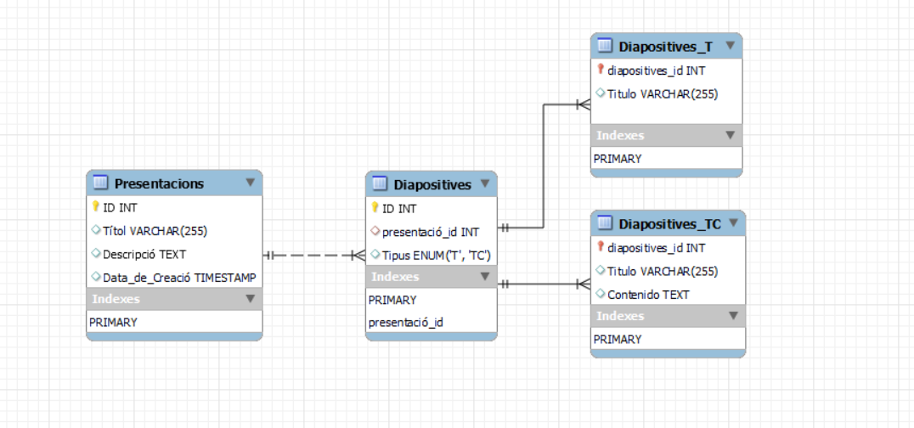

La clase *presentacion* está compuesta de:

* Un identificador de tipo autonumerico.

* Un titulo, tipo String con máximo de 50 carácteres.

* Una descripción, String con máximo de 255 carácteres.

* La fecha de creación de tipo TimeStamp.

La clase *diapositiva* está compuesta de:

* Un identificador de tipo autonumerico.

* Referencia al identificador de la clase presentación.

* Referencia al identificador de la clase tipoDiapositiva.

La clase *tipoDiapositiva* está compuesta de:

* Un identificador de tipo autonumerico.

* El tipo de la diapositiva, de tipo solo Título o Título + Contenido. 

=== Interfícies

==== Sketching

==== Figma
Link a Figma https://www.figma.com/team_invite/redeem/RM69mgDaCtdKsgKBqfrjf1[aquí]

[underline]#Pantalla Home#

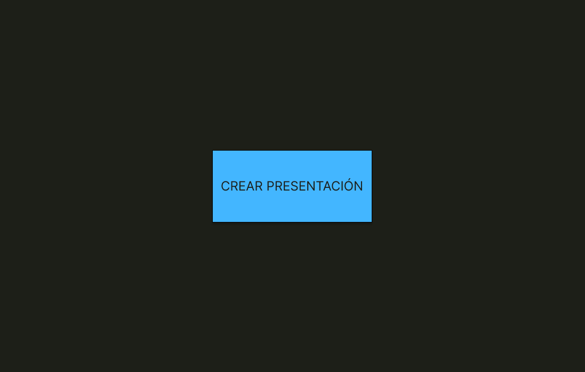

Compuesta por un botón principal que permite la creación de una nueva presentación.

[underline]#Pantalla Home Listado#

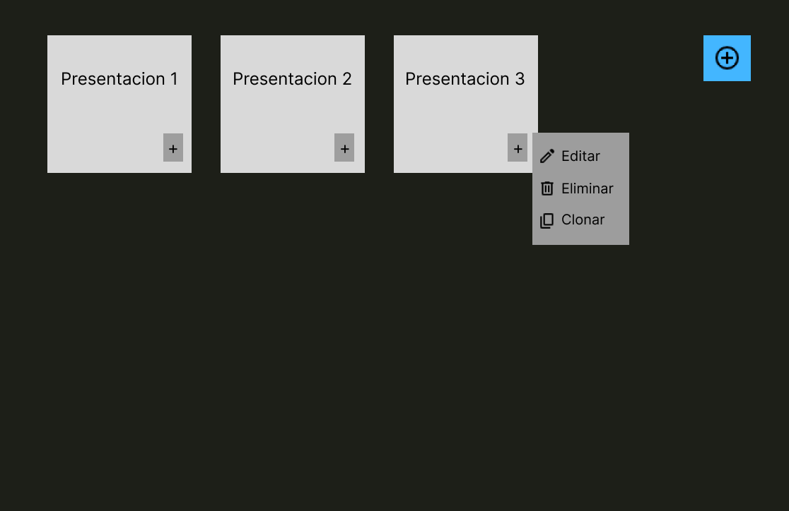

(Esta pantalla solo se mostrará una vez se hayan creado presentaciones).

Compuesta por varias cajas que representan las diferentes presentaciones creadas, donde dentro de éstas se muestra el título que se la ha establecido a la presentación y un botón que al hacer clic en él, permite *editar*, *eliminar* o *clonar* la presentación. 

Además del botón posicionado en la parte superior derecha para *añadir* una nueva presentación. 

Por último, para poder *visualizar* estas presentaciones, solamente se tendria que hacer un clic en la "caja" de la presentación.  

=== Guía de estilos

== DESARROLLO
=== Alfred
[underline]#Vagrantfile#

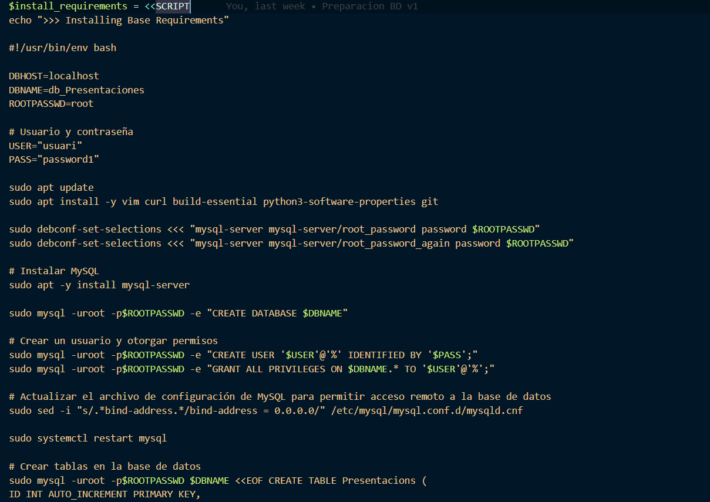

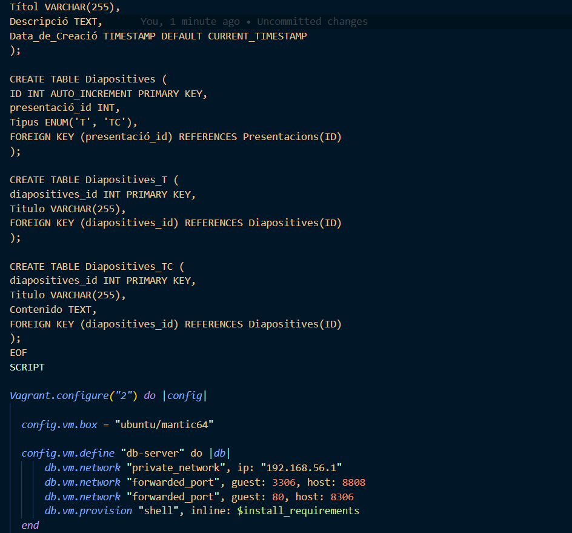

[underline]#crear_p.html#

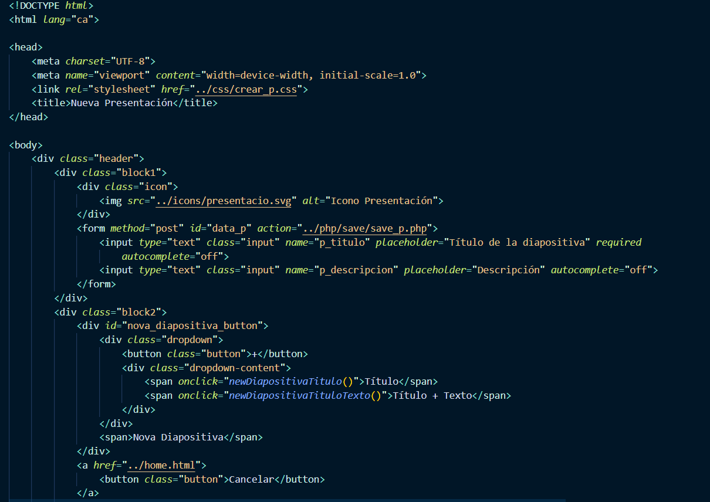

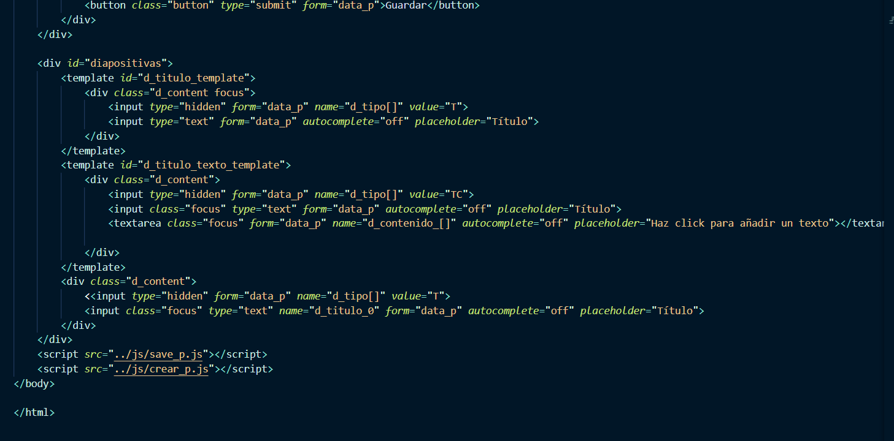

[underline]#save_p.js#

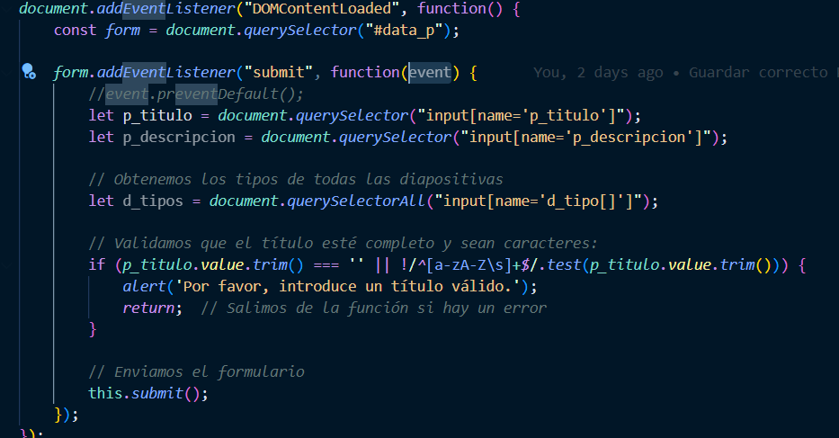

[underline]#crear_p.js#

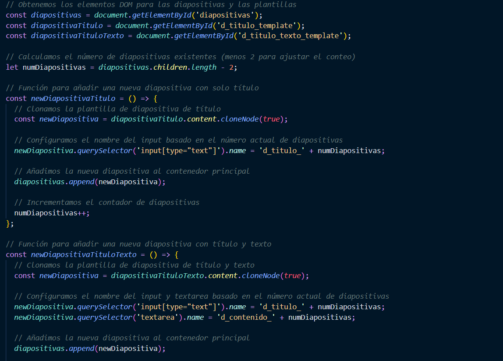

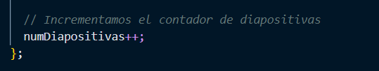

[underline]#save_p.php#

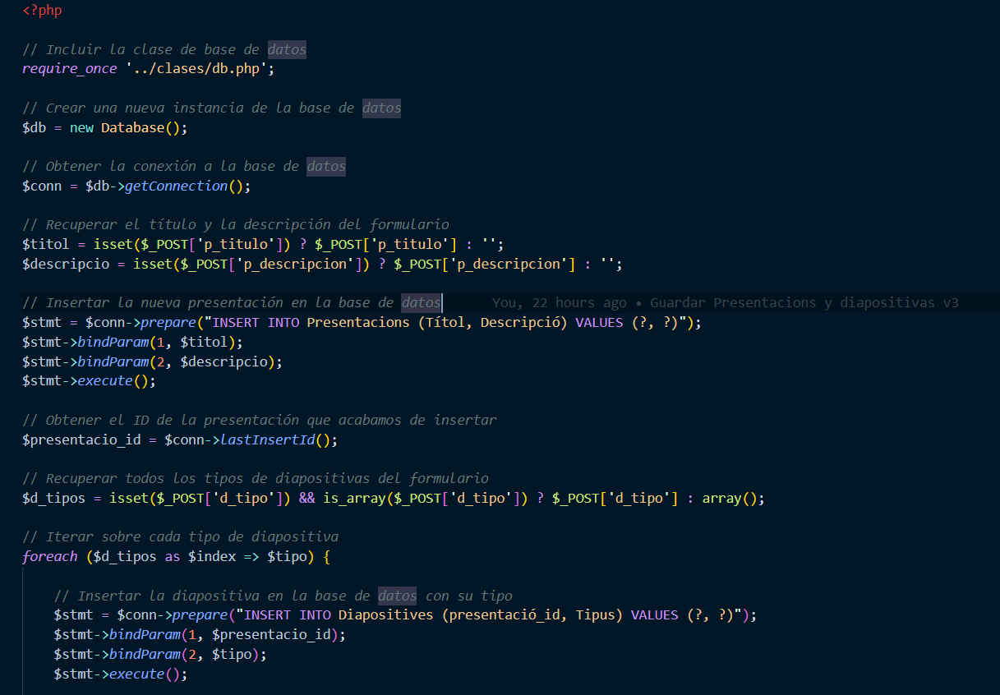

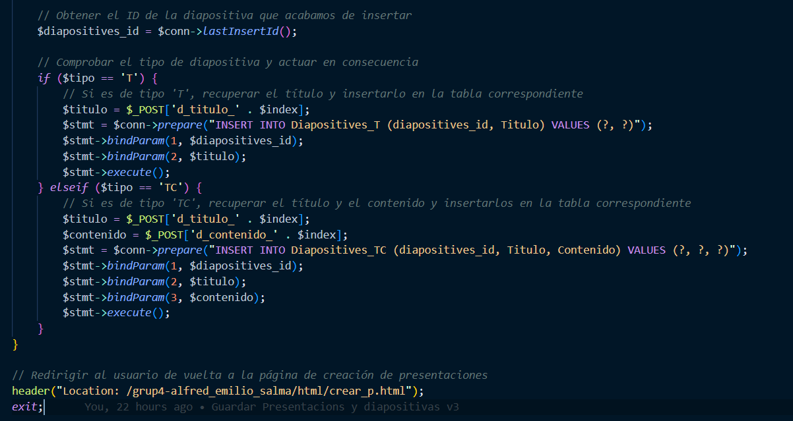

[underline]#Fuentes y css#

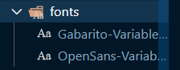

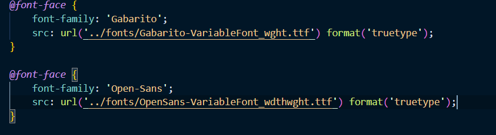

== CONCLUSIÓN
=== Línias futuras
=== Webgrafía
